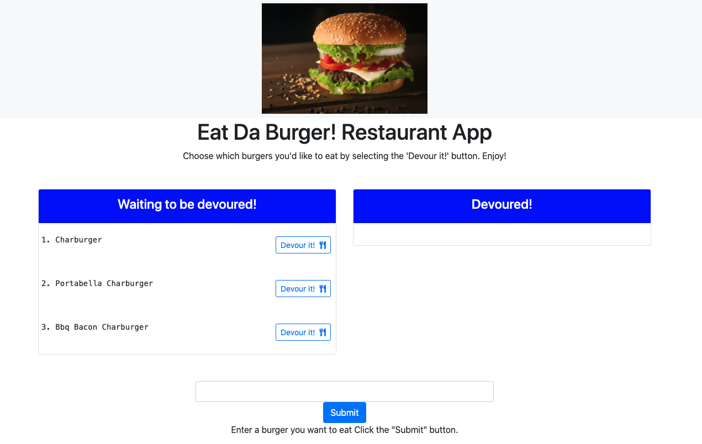
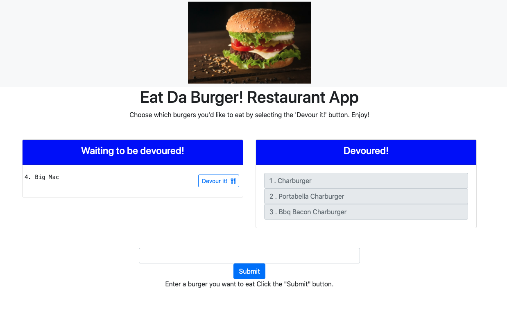

# Node Express Handlebars - Eat-Da-Burger!

## Description

My assignment was to create and build a burger logger utilizing MySQL, Node, Express, Handlebars, and an ORM.  I was also tasked with deploying my app on Heroku.

## Table of Contents 

* [Deployment](#deployment)

* [Screenshots](#screenshots)

* [Author](#author)

## Deployment
### Heroku Link
[Click here](https://safe-citadel-99882.herokuapp.com/burgers)

## Screenshots

* **Waiting to be devoured!**

* **Devoured!**

## Author

* **Eric Donohue**

### Other Projects

Please visit [edonohue8](https://github.com/edonohue8/) to see more of my projects.